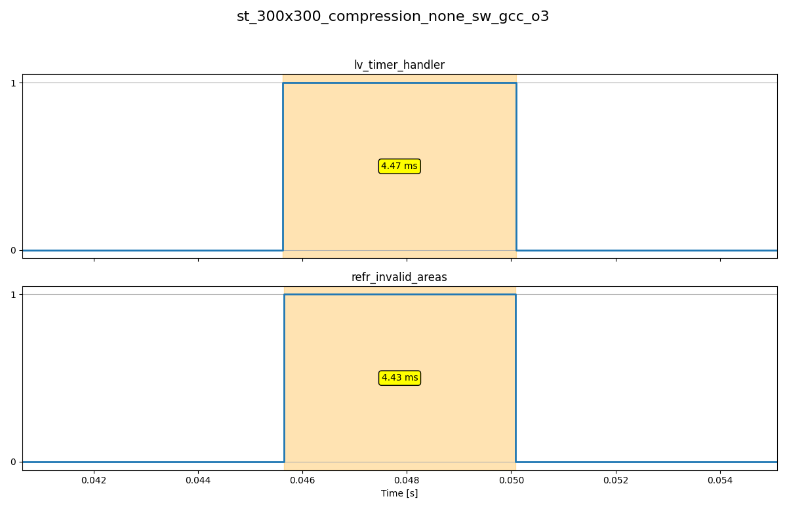
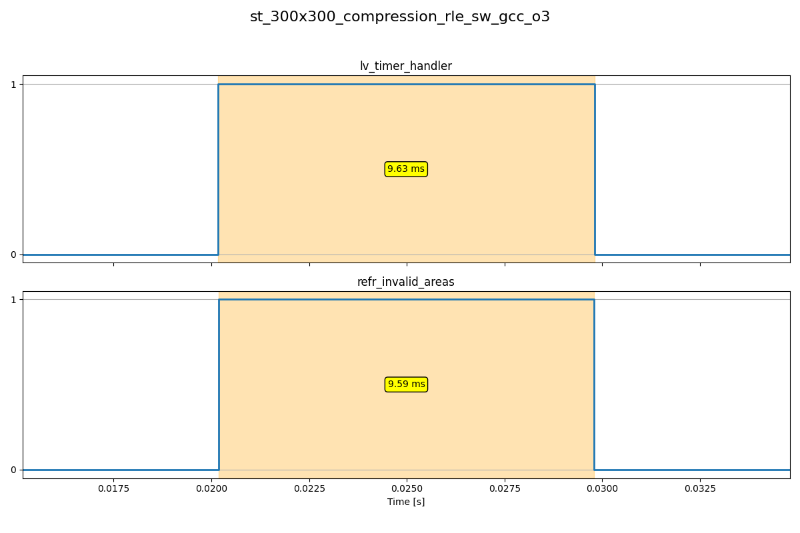
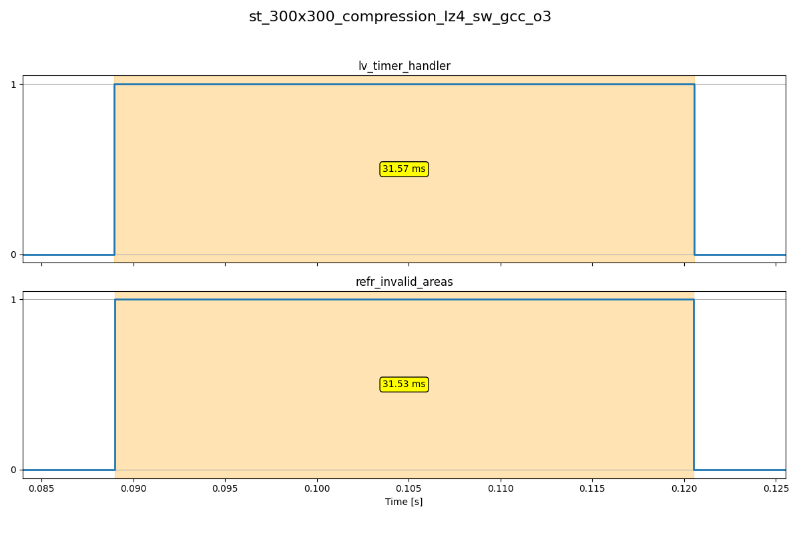
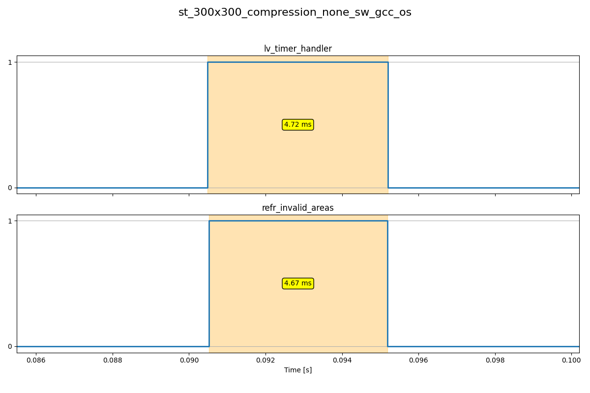
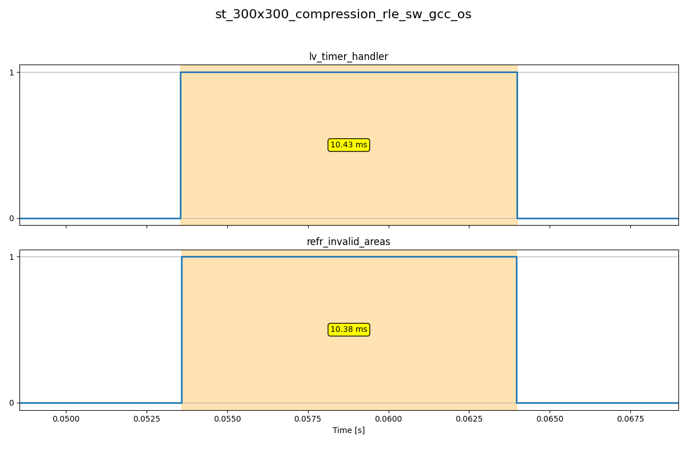
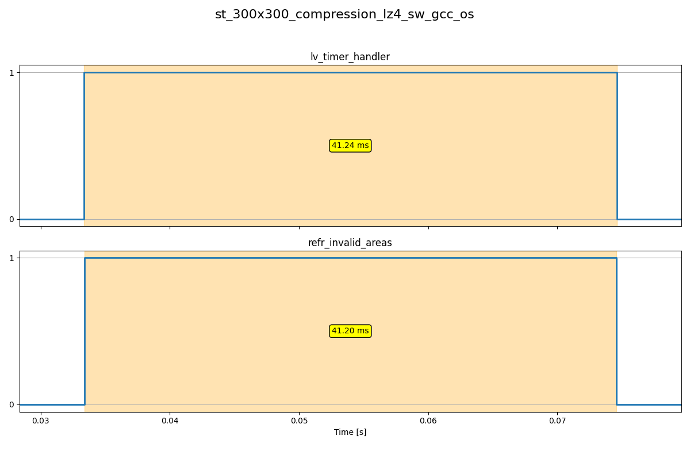

# Benchmark Results

## Results for: st_300x300_compression_none_sw_gcc_o3

| Metric             | Duration (ms) |
|--------------------|---------------|
| lv_timer_handler   |          4.47 |
| refr_invalid_areas |          4.43 |

---

## Results for: st_300x300_compression_rle_sw_gcc_o3

| Metric             | Duration (ms) |
|--------------------|---------------|
| lv_timer_handler   |          9.63 |
| refr_invalid_areas |          9.59 |

---

## Results for: st_300x300_compression_lz4_sw_gcc_o3

| Metric             | Duration (ms) |
|--------------------|---------------|
| lv_timer_handler   |         31.57 |
| refr_invalid_areas |         31.53 |

---

## Results for: st_300x300_compression_none_sw_gcc_os

| Metric             | Duration (ms) |
|--------------------|---------------|
| lv_timer_handler   |          4.72 |
| refr_invalid_areas |          4.67 |

---

## Results for: st_300x300_compression_rle_sw_gcc_os

| Metric             | Duration (ms) |
|--------------------|---------------|
| lv_timer_handler   |         10.43 |
| refr_invalid_areas |         10.38 |

---

## Results for: st_300x300_compression_lz4_sw_gcc_os

| Metric             | Duration (ms) |
|--------------------|---------------|
| lv_timer_handler   |         41.24 |
| refr_invalid_areas |         41.20 |

---
