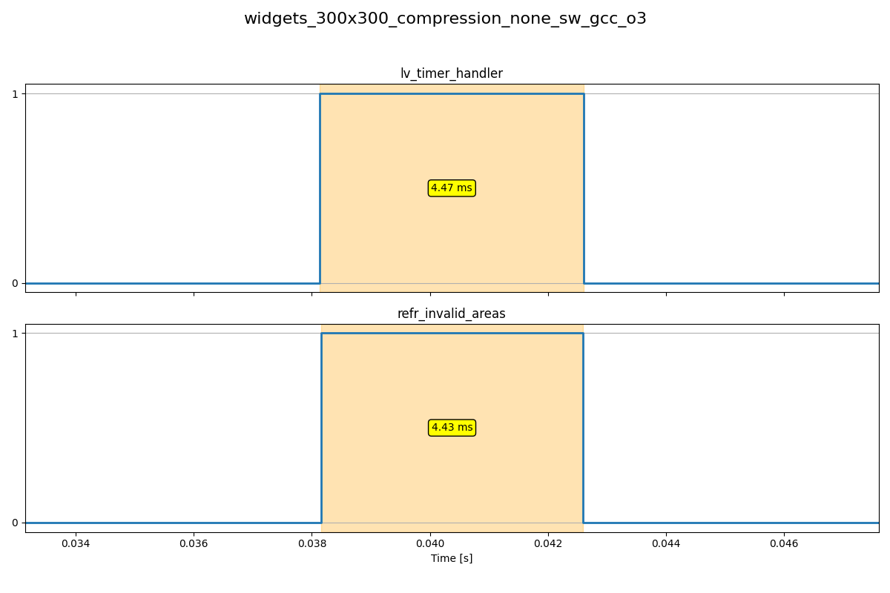
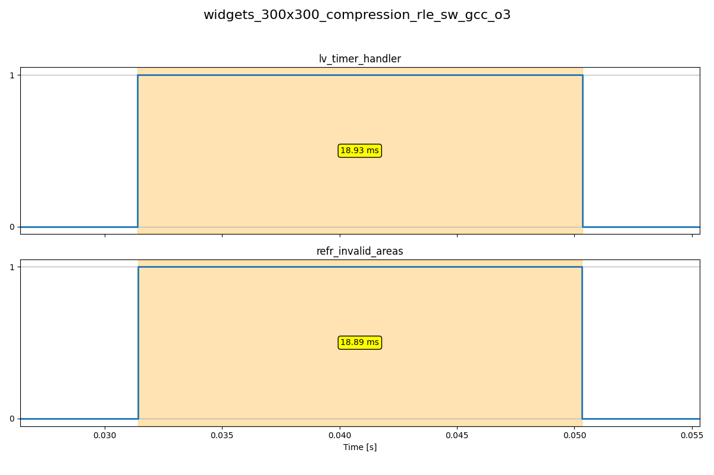
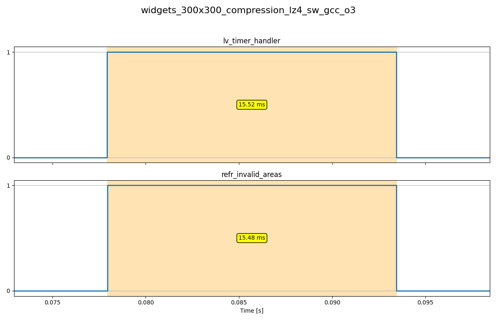
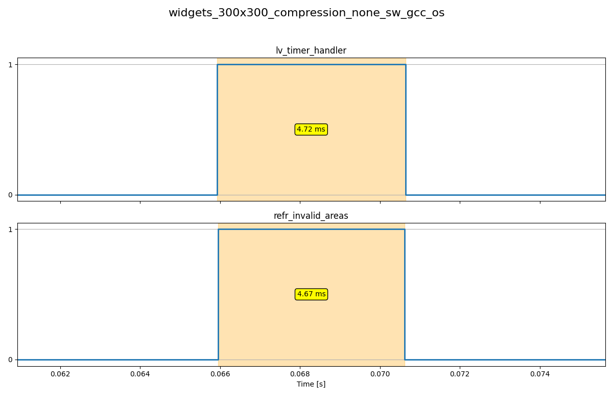
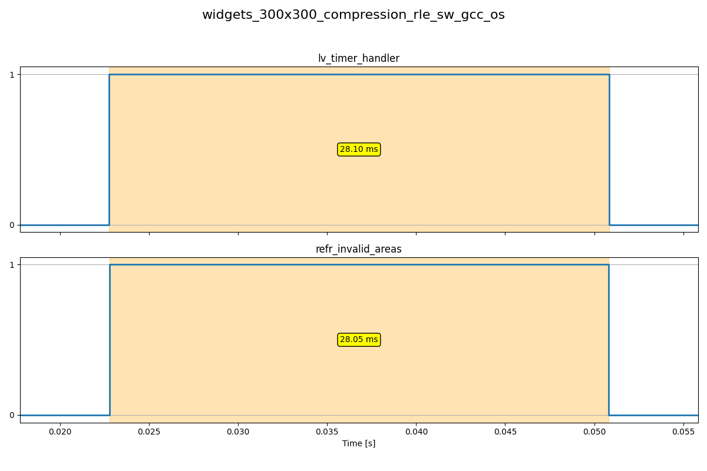
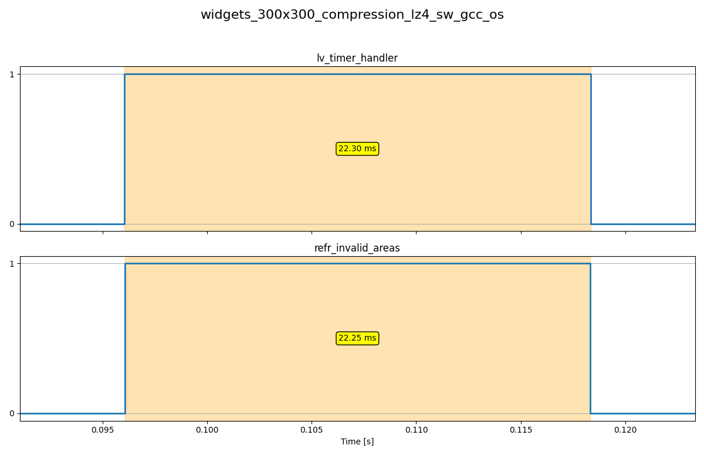

# Benchmark Results

## Results for: widgets_300x300_compression_none_sw_gcc_o3

| Metric             | Duration (ms) |
|--------------------|---------------|
| lv_timer_handler   |          4.47 |
| refr_invalid_areas |          4.43 |

---

## Results for: widgets_300x300_compression_rle_sw_gcc_o3

| Metric             | Duration (ms) |
|--------------------|---------------|
| lv_timer_handler   |         18.93 |
| refr_invalid_areas |         18.89 |

---

## Results for: widgets_300x300_compression_lz4_sw_gcc_o3

| Metric             | Duration (ms) |
|--------------------|---------------|
| lv_timer_handler   |         15.52 |
| refr_invalid_areas |         15.48 |

---

## Results for: widgets_300x300_compression_none_sw_gcc_os

| Metric             | Duration (ms) |
|--------------------|---------------|
| lv_timer_handler   |          4.72 |
| refr_invalid_areas |          4.67 |

---

## Results for: widgets_300x300_compression_rle_sw_gcc_os

| Metric             | Duration (ms) |
|--------------------|---------------|
| lv_timer_handler   |         28.10 |
| refr_invalid_areas |         28.05 |

---

## Results for: widgets_300x300_compression_lz4_sw_gcc_os

| Metric             | Duration (ms) |
|--------------------|---------------|
| lv_timer_handler   |         22.30 |
| refr_invalid_areas |         22.25 |

---
